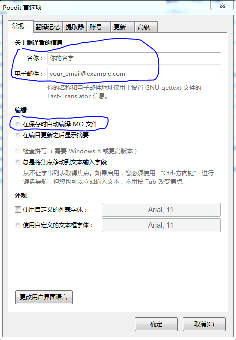

## 1.概述

本项目致力于[postgis官方手册](http://postgis.net/documentation/)的翻译。

`postgis-2.2.0dev`的word版翻译文档由伏念提供。`postgis-2.3.3`及后续版本则在官方po文件的基础上翻译。

## 2.文档翻译

1. 下载本git仓库

		git clone https://github.com/postgres-cn/postgisdoc.git

2. 下载po文件编辑器poedit

		http://poedit.net/download 

3. 设置用户名
	
	打开poedit，点击`文件`->`首选项`
	
	- 在`Poedit首选项`窗口，设置自己的邮箱和用户名,这些信息会在保存po文件时记录到po文件的`Last-Translator`里。

	- 取消`在保存时自动编译MO文件`选择框

	
	
4. 翻译po文件

	postgis的po资源文件在`doc\po\zh_CN`目录，用Poedit打开该目录中需要翻译的po文件，对每个消息进行翻译
	
	
	
	翻译完成后，点击`保存`。

5. 修改更新履历

翻译完po文件后，在po文件头部属上自己签名

	# Translators:
	# FIRST AUTHOR <EMAIL@ADDRESS>, 2017

## 3. 注意事项

po文件的消息提取自docbook格式xml文件，带有xml标签和实体引用，翻译时注意保留xml标签和实体引用的格式，否则会导致文档编译出错。

使用google翻译进行辅助翻译时，英文原文中的xml标签会被篡改，请**务必**手工改回来

下面是google译文的一个例子

**原文**

	The &quot;<ulink url="http://www.opengeospatial.org/standards/sfs">
	Simple Features for Specification for SQL</ulink>&quot; is available 
	at the OpenGIS Consortium web site: 
	<ulink url="http://www.opengeospatial.org/">http://www.opengeospatial.org/</ulink>.

**google译文**

	“<ulink url =”http://www.opengeospatial.org/standards/sfs“> SQL规范的简单功能</ ulink>”
	 可在OpenGIS Consortium网站上获得：
	<ulink url =“http://www.opengeospatial.org/”> http://www.opengeospatial.org/ </ ulink>。

上面的译文中，google翻译出现了多处对xml的篡改，都需要一一改回来。
- 实体引用`&quot;`被解引用成`“`
- `=`前面多加了一个空格，比如`url =`
- 把xml中的半角双引号`"`改成了全角双引号`“`和`”`
- 结尾tag被多加上了空格，比如`</ ulink>`

**纠正后的译文**

	&quot;<ulink url="http://www.opengeospatial.org/standards/sfs">SQL规范的简单功能</ulink>&quot;
	 可在OpenGIS Consortium网站上获得：
	<ulink url="http://www.opengeospatial.org/">http://www.opengeospatial.org/</ulink>。

## 4. 翻译管理

翻译进度及翻译任务的管理参照以下wiki页面

- [postgis-2.3.3的翻译](https://github.com/postgres-cn/postgisdoc/wiki/postgis-2.3)

## 5. 在线文档

- [postgis-2.3.3中文手册(翻译中)](http://postgres.cn/docs/9.6/postgis-2.3)

## 6. 本地文档编译

文档编译参考以下CentOS7上编译postgis-2.3.3的步骤

1. 下载本git仓库

	git clone https://github.com/postgres-cn/postgisdoc.git

2. 下载对应版本的postgis源码包

	postgis-2.3.3.tar.gz

3. 安装依赖的软件包

		yum install https://download.postgresql.org/pub/repos/yum/9.6/redhat/rhel-7-x86_64/pgdg-centos96-9.6-3.noarch.rpm
		yum install geos geos-devel
		yum install proj proj-devel
		yum install ImageMagick xsltproc dblatex
		yum install docbook-style-xsl kdesdk-poxml
		yum install postgresql96-devel 

4. 编译

		tar xzf postgis-2.3.3.tar.gz
		cp -rf postgisdoc/postgis-2.3.3/* postgis-2.3.3/

		cd postgis-2.3.3
		PATH=$PATH:/usr/pgsql-9.6/bin ./configure --without-raster		
		cd doc
		make html-localized

生成结果为单个的html文件`doc/html/postgis-cn.html`,可以通过打印这个文件生成pdf。
(Makefile中有一个`make pdf-localized`任务虽然可以编译本地化的pdf，但是不支持中文)

